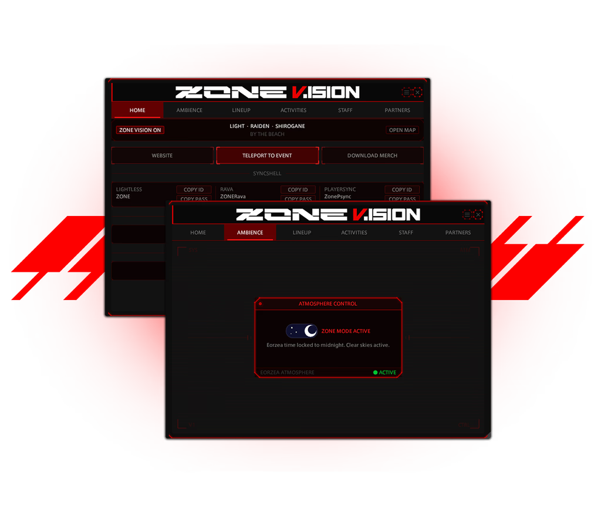

# ZONE

Dalamud plugin companion for the ZONE music festival event in Final Fantasy XIV, March 27 & 28, 2026.

Shows the live lineup, DJ schedule, activity tracker, staff directory, and a HUD overlay (Zone Vision). Includes a midnight time lock for full atmosphere immersion.

## Commands

`/zone` opens the main window

`/zonevision` toggles the Zone Vision overlay

## Installation

This plugin is not on the official Dalamud repository. To install it:

1. In-game, type `/xlsettings` to open Dalamud settings
2. Go to **Experimental** and paste this URL under **Custom Plugin Repositories**:
   `https://raw.githubusercontent.com/NalaPraline/ZONE/main/pluginmaster.json`
3. Save, then open `/xlplugins`, search for **Zone** and install it

The [Lifestream](https://github.com/NightmareXIV/Lifestream) plugin is required if you want to use the teleport button to get directly to the event location.

## License

GNU Affero General Public License v3.0, see [LICENSE.md](LICENSE.md) for details.
